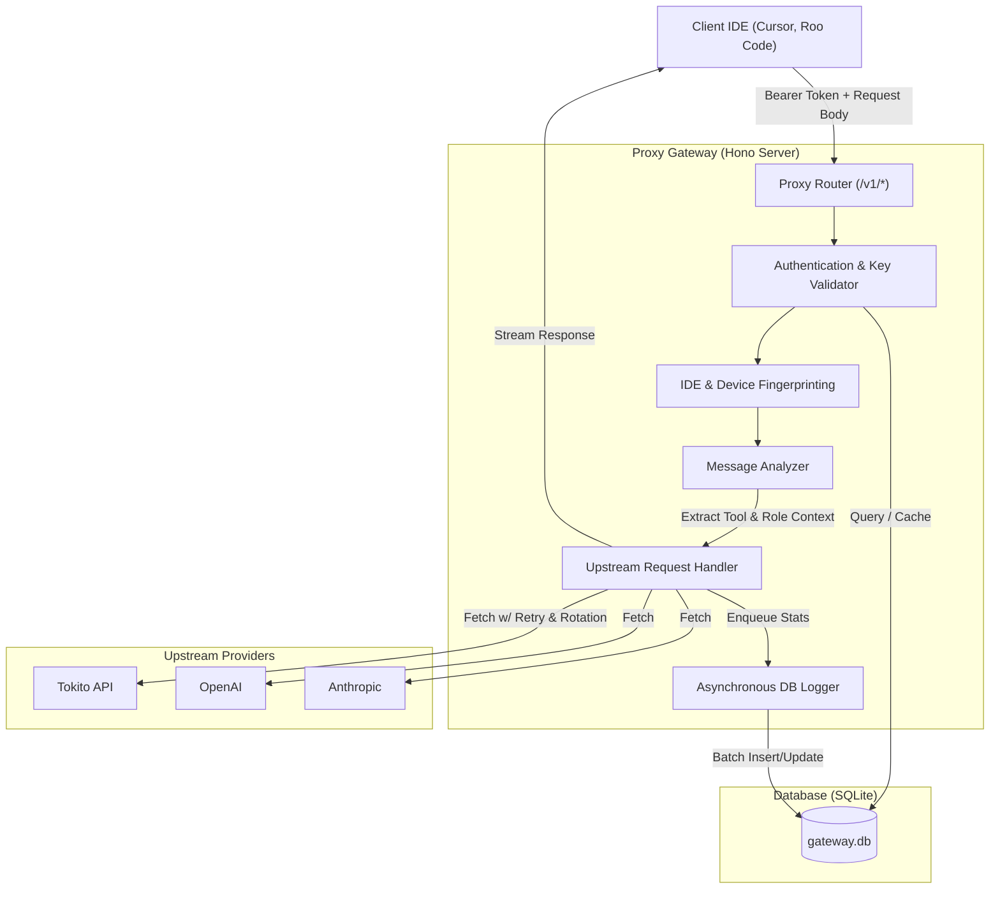

# Proxy Gateway Architecture

## Overview
This document provides a comprehensive, deeply detailed view of the `monit_api` architecture. The system consists of two main components:
1. **Proxy Gateway (`packages/proxy`)**: An AI request interception and routing engine built with Hono and Node.js.
2. **Discord Bot (`packages/bot`)**: A management and verification interface allowing users to track usage, and administrators to verify tokens and monitor models.

## High-Level Architecture
The core purpose of the proxy gateway is to sit between IDEs (like Cursor, Roo Code, etc.) and upstream AI providers (OpenAI, Anthropic, Gemini, Tokito).

## Key Components / Modules

### Proxy Router & Middleware
The gateway intercepts all requests to `/v1/*`. It first checks public endpoints (like `/v1/models`), but for completions, it begins the validation chain:
1. **Header Validation**: Ensures `Authorization: Bearer <key>` is present.
2. **Key Validation**: Queries the `apiKeys` table (with caching via `cache.ts`) to ensure the key is valid, active, and not restricted by IP or Device policies.
3. **Fingerprinting**: Generates a device fingerprint from **machine bucket (OS + arch) + normalized IDE name**. IP and `x-device-id` are stored for logging but excluded from the hash. Same IDE with a UA version bump stays one slot; switching IDE (e.g. Cursor → Cline) opens a **new** slot.
4. **Device slots**: Default `maxDevices = 2` (account-scoped via `discord_user_id`). Over-limit opens a 30-minute confirm challenge (Discord DM + portal) with provisional access — **no auto key rotate**. Second deny for the same fingerprint blacklists it. See `docs/features/device_slots.md`.

### IDE Detection & Analytics
The proxy parses the `User-Agent` and even inspects the request body content (via `detectIdeFromContent` in `detect-ide.ts`) to identify the exact client (e.g., Cursor, Roo Code). This enables IDE-specific logic, such as deduplicating automated tool requests.

### Message Analyzer (`message-analyzer.ts`)
This component inspects the incoming JSON payload to determine:
- `turn_id` bounds: Is this a brand new user prompt, or an automated tool follow-up?
- `model`: Extracts the requested model name.
- Formatting: Handles translating generic OpenAI payloads into Anthropic/Responses API payloads if needed.

### Upstream Routing (`proxy.ts` -> `anthropic-adapter.ts`)
Once validated, the proxy routes the request to the correct upstream provider. 
- It supports **API Key Rotation**: If a provider key hits a 429, it rotates to the next available key.
- It supports **Format Translation**: E.g., converting OpenAI chat completion requests into Anthropic Messages API formats on the fly.

## Data Flow
1. Client sends request to Proxy.
2. Proxy validates token and limits.
3. Proxy forwards request to correct upstream.
4. Upstream streams response back.
5. Proxy pipes stream to client and simultaneously counts tokens.
6. Proxy asynchronously logs the final token count to the database.

## Security & Constraints

### Asynchronous Logging (`logWriteQueue`)
To prevent database locking during high traffic, the proxy does not block the client while writing logs.
Instead, it pushes log data into an in-memory queue (`logWriteQueue`). A background worker drains this queue using SQLite transactions, bulk inserting into `request_logs` and updating `chat_sessions`.