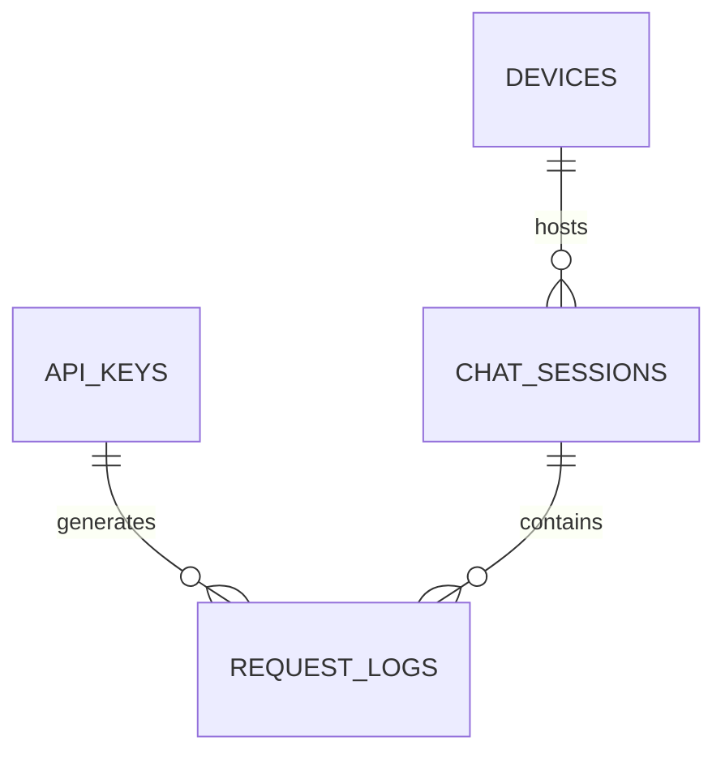

# Gateway Database Schema

## Overview
The `monit_api` uses SQLite via `drizzle-orm` for lightweight, high-performance local storage. The schema is defined in `packages/proxy/src/db/schema.ts`. This database handles authentication, usage tracking, and system configuration.

## Core Tables

### `authSessions`
Persisted login sessions for the admin dashboard and client portal (survive process restarts).
- `sessionHash`: SHA-256 of the opaque cookie id (raw id never stored).
- `kind`: `admin` | `portal`.
- `discordUserId`: set for portal sessions; null for admin.
- `createdAt`: hard max lifetime is 3 days from this timestamp.
- See `docs/features/auth_sessions.md`.

### `apiKeys`
The primary authentication table linking keys to limits and Discord users.
- `key`: The actual Bearer token.
- `keyHash`: SHA-256 hash for secure lookups.
- `discordUserId`: Links the key to the Discord Bot system.
- `promptLimit`, `monthlyTokenLimit`, `dailyTokenLimit`: Per-key overrides for global limits.

### `devices`
Tracks IDE/machine slots using the API to enforce the `maxDevices` policy.
- `fingerprint`: `sha256("slot:" + machineHint + "|ide:" + normalizedIde)`. IP is logging-only. Different IDEs on the same OS/arch are different slots.
- `isProvisional`: true while a device-confirm challenge is open (does not count toward max until approved).
- `requestCount`: Total requests made by this device.
- `apiKeyId`: Owning key. Slots are enforced per Discord account across sibling keys.
- See `docs/features/device_slots.md`.

### `device_challenges`
30-minute confirm when slots are full. Status: `pending|approved|denied|expired`. `token` binds Discord buttons and portal actions.

### `user_notifications`
Durable portal notification history (`device_confirm`, etc.). Popup only while actionable; expired items remain in the recent list with actions disabled.

### `allowed_devices`
Allow/block rules by fingerprint or IP. **Block rows are always enforced** even when `devicePolicy = none` (auto-blacklist after 2 denies).

### `chatSessions`
Groups multiple requests into a logical IDE conversation session.
- `sessionId`: A unique ID.
- `deviceFingerprint`: Links the session to a machine.
- `model`, `provider`, `ideDetected`: Contextual data for the session.
- `lastUserMessageHash`: Used to detect when a user sends a brand new prompt vs when the IDE just automatically sends tool results.

### `requestLogs`
The most heavily utilized table, recording every single upstream hit.
- `apiKeyId`, `deviceFingerprint`, `sessionId`.
- `turnId`: A string identifying a specific "user prompt turn". All automated tool calls triggered by one user prompt share this ID.
- `isCountedRequest`: Boolean. True if it's the start of a new turn, False if it's a tool-followup.
- `contextDeltaTokens`: The number of *new* context tokens added since the last request in this session.
- `completionTokens`: Output tokens.

### `modelLimits`
Allows for granular control over limits based on the specific model.
- `scope`: Can be `global` (applies to all users using the model) or `key` (applies to a specific user using the model).
- `model`: The model string (e.g., `ag/claude-3-opus`).
- Overrides for prompts, input tokens, and output tokens.

## Maintenance Tables

### `cleanupState`
Tracks the progress of the automated log rotation.
- `cleanupType`: e.g., `3month`
- `cleanedMonths`: JSON array of months that have been archived and purged.

### `monthlyStats`
When raw `requestLogs` are purged (after 3 months), the aggregated totals are dumped into this table so all-time usage stats are preserved indefinitely without taking up massive disk space.

## Relationships

## Indexing & Performance considerations
- `requestLogs` is heavily indexed on `sessionId` and `turnId` for fast token aggregation.
- The `logWriteQueue` mechanism (detailed in architecture) prevents write-locking issues on these tables during high load.