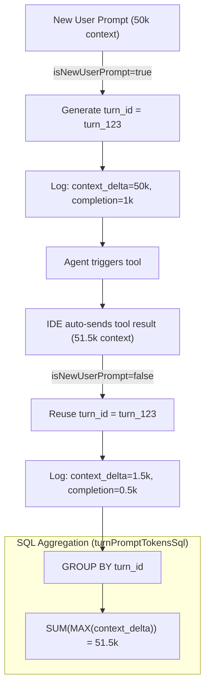

# Rate Limiting & Token Accounting

The `monit_api` handles complex rate-limiting and token counting strategies necessary for supporting various AI IDEs with automated tool execution.

---

## 1. The Token Counting Challenge
IDEs like Cursor and Roo Code operate by sending the entire conversation history on every single request. When an AI agent executes a tool (e.g., `read_file`), the IDE sends the prompt, gets the tool call, executes it, and sends the prompt + tool call + tool result back to the AI.

If we simply summed the tokens of every request, a 10-step agent loop with a 50k token context would be counted as 500,000 tokens, draining a user's limits unfairly.

### The Solution: `turn_id` Deduplication
To solve this, the proxy tracks "Turns" (a single user-initiated action).
1. When a user types a new prompt, `isNewUserPrompt` becomes `true`. The proxy generates a new `turn_id` and stores it in cache.
2. For all subsequent automated tool requests within that turn, the proxy reuses the same `turn_id`.
3. In `request_logs`, we store the `context_delta_tokens` (the difference in context size between requests).
4. When checking token limits, the SQL functions in `utils/counting.ts` group by `turn_id` to ensure context tokens are only counted once per turn.



---

## 2. Roo Code vs Cursor Message Formatting
A critical feature in `message-analyzer.ts` handles how different IDEs wrap tool responses.
- **Cursor**: Uses standard OpenAI `tool_calls` and `tool` role messages.
- **Roo Code**: Embeds tool results inside a standard `user` message wrapped in `<tool_response>` XML tags.

The analyzer specifically scans for `<tool_response>` tags to convert these faux-user messages into `tool` roles internally, ensuring `isNewUserPrompt` evaluates correctly and `turn_id`s are not prematurely reset.

---

## 3. Limit Hierarchy
Rate limits and Token limits are evaluated in a specific hierarchy during the request lifecycle in `proxy.ts`:

1. **API call (hop) limit**: Every successful upstream hop counts. Key `rate_limit` → else `global_rate_limit` (default **500 / 5h**). Checked on every hop before upstream. Window is **sliding** (last N hours from now).
2. **Per-Model Prompt Limits**: Checked when starting a new turn for a specific model (sliding window).
3. **Global Prompt Limits**: 1 per `turn_id` (user turn). Key `prompt_limit` → else `global_prompt_limit` (default **50 / 5h**). Tool follow-ups on the same turn do not burn prompt quota. Window is **sliding**.
4. **Daily / Monthly Token Limits**:
   - **Base In/Out**: key custom (>0) → else global for Phantom/Staff (`follow_global`); Premium/Pro (`zero_unless_addon`) baseIn = 0 until add-on; with add-on, Premium/Pro still get global Out as baseOut.
   - **Without add-on**: hard caps = Input + Output only. Daily total unlimited unless key sets custom `daily_token_limit`.
   - **With add-on**: pack **adds to Input only** (e.g. Phantom 2M + pack 10M = **12M In**, Out stays 5M). I/O remain **hard caps**. Daily stays unlimited unless key custom daily. Per-model prompt caps bypassed.
   - Premium/Pro without add-on: blocked (`zero_unless_addon`) — no shared quota and no dedicated pools.
5. **IDE Smart Anti-Waste** (optional, default on): see [`ide_anti_waste.md`](./ide_anti_waste.md) — stub duplicate tool dumps + soft nudge + SSE short-circuit after repeated identical noisy tools (does **not** hard-stop the IDE).

### Naming

| Concept | EN | ID | What counts |
|---------|----|----|-------------|
| Prompt | Prompts | Prompt | Distinct `turn_id` in rolling window |
| API call | API calls | Panggilan API | Each 2xx hop |
| Turn (stats) | Turns | Turns | Same as prompts for period stats (`requests` field kept for API compat) |

### 3.1 Daily Reset Timezone Logic
The proxy explicitly enforces daily limits based on **Midnight WIB (UTC+7)**, not standard UTC.

```typescript
const wibOffset = 7 * 60 * 60 * 1000;
const wibNow = new Date(Date.now() + wibOffset);
const dw = new Date(wibNow); dw.setUTCHours(0, 0, 0, 0); // Sets to midnight
// dw is then converted back to UTC string for SQLite comparison
```
This ensures users in Indonesia experience a predictable reset at exactly 00:00 local time.

---

## 4. Model overrides & dedicated pools

`model_limits` rows can be **global** (`scope=global`, `scope_id=0`) or **per-key** (`scope=key`). Resolution order for a request:

`keyExact → keyPattern (longest) → globalExact → globalPattern (longest)`.

| Mode | `dedicated_quota` | Behavior |
|------|-------------------|----------|
| Subcap (default) | `false` | Extra ceiling on that model; usage **still** counts toward account daily / daily input / daily output |
| Dedicated pool | `true` (+ `daily_token_limit` > 0) | Usage matching the rule is **excluded** from account daily / input / output; only the model `daily_token_limit` (and model monthly if set) applies. Account **monthly** still includes dedicated usage |

When the account **shared** daily / input / output pool is exhausted, virtual `auto` only tries models that match a dedicated rule (e.g. grok pool). Other online models are not attempted. If no dedicated candidate remains (or its pool is also exhausted), the client gets a clear 429.

Live meters (Discord Usage, admin Live Usage, portal Usage Today) show:

- **Input Harian** bar = limit credit, with sublabel `context (cached) + input (billable)`
- **Dedicated model pools** section when ≥1 dedicated rule applies

Seeded default: global pattern `tokito/gcli/grok-4.5`, 3M tokens/day **total** (input+output as one hop-weighted pool), `dedicated_quota=true`. Editable anytime via Admin Settings → Model Limits (or per-key override). Optional `daily_input_token_limit` / `daily_output_token_limit` on the same row enforce separate I/O caps inside that pool; Discord / admin Live Usage / portal meters pick up changes automatically.

Pattern matching for slash-containing rules also checks the raw/catalog model id (normalize strips `tokito/` / `gcli/`, so bare `grok-4.5` alone is not enough). Slash tails are matched too: rule `tokito/gcli/grok-4.5` counts logs `tokito/gcli/grok-4.5`, `gcli/grok-4.5`, and `auto (gcli/grok-4.5)` — not `amanai/grok-4.5`.